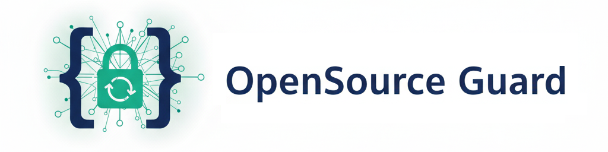
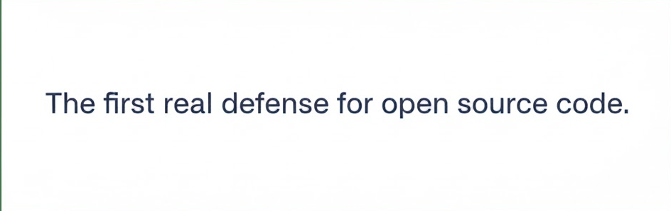

---
## Table of content

- Introduction
    - [What problem does this tool solve?](#what-problem-does-this-tool-solve)
    - [Briefly about AI crawlers and the law](#briefly-about-ai-crawlers-and-the-law)
    - [What does this tool protect you from?](#what-does-this-tool-protect-you-from)
    - [Manifesto](#manifesto)
    - [Available protections](#available-protections-of-intellectual-property)
    - [So how exactly OpenSource Guard protects open source code?](#so-how-exactly-opensource-guard-protects-open-source-code)
    - [Legal Advice](#legal-advice)
- In detail
    - [Usage notes](#usage-notes)
    - [The benefits of this tool](#the-benefits-of-this-tool)
        - [Little intro on used algorithms](#little-intro-on-these-algorithms)
- Usage
    - [Usage flow](#usage-flow)
    - [Code example](#code-example)
- [Author](#author)
- [Licence](#licence)

---


----
## What problem does this tool solve?

- We are living times that anything public means it's not yours anymore.
- Anyone can grab your code, laugh at the licence, then reuse, repurpose, republish as their own, feed it to
  AI crawlers.
- Most “open-source protection” advice is utopian: blocklists, licenses, code etiquette.
- In reality, as in life the majority doesn't respect the rules but respect the gun.

TLDR: **This tool gives you hands-on protection for your open-source projects from code stealers.**

---
## What does this tool protect you from?

- AI crawlers.
- Those who will violate the license anyway.
- Individuals who modify the code and re-license it as their own.
- Other unwanted steals.

---
## Briefly about AI crawlers and the law

- ClaudeBot AI crawler was accused of hammering websites a million or more times a day.

- The author of [Nepenthes](https://zadzmo.org/code/nepenthes/) reported
    - Facebook's crawler exceeding 30 million hits on his site

- Joel Tenenbaum was fined $675,000 for 30 songs.
- Jammie Thomas-Rasset was ordered to pay over $1.9 million for 24 songs.
- 2022-2024 Meta downloaded 81.7 TERABYTES of content via BitTorrent to train its AI systems. **Judge dismissed the
  authors' copyright case.**

---
## Manifesto

1. No, _"not everything open-source is free to use. And if you think otherwise, then keep your code private."_
2. This is indeed the mentality of a typical scammer: unintelligent, selfish, greedy and ignorant. The one this tool
   opposes.

---

## Available protections of intellectual property

- For **media** you can use data poisoning.
- For **websites** you can
  use [infinite loading](https://zadzmo.org/code/nepenthes/), [mazes](https://blog.cloudflare.com/ai-labyrinth/) or 25
  seconds on initial request (my favorite solution).
- So the **open source code is absolutely vulnerable** and the only way is obfuscation (turning code into trash tbh).

---

## So how exactly OpenSource Guard protects open source code?

> This project suggests an alternative idea that hits the weakest spot of any AI crawler: **the classification of data**

- All crawlers have classifiers if the data is good or bad. Crawler's defense against obfuscated or literally bad data.
- Also, **crawlers can not decrypt data live** because it's wasted resources = lost money for the companies.

> So, **the core idea** is in encoding the important and critical files of your open source code!
>
> E.g. abstraction layers, **parts with critical business logic**, settings, file with constants, etc, or even the
> entire project.

This way:

- The AI crawler won't take your project, as it's partially/entirely encrypted, as it will take huge time to brute force
  your encryption key.
- The code stealer individuals are gonna face the same problem with brute forcing.

#### TLDR: OpenSource Guard takes your notes "Please don't steal my car", instead locks it and gives you the key of the lock. And if someone still steals it, it’s on them.

---

## Legal advice

- Legally, no one can force you to upload source code to GitHub in plain text (but not encrypted files).
- Anyways you can still explicitly mention that all usage must be in accordance with the licence, which disallows
  whatever you wanna disallow, e.g. redistribution, AI-training, etc.
- Also, you can explicitly mention that the files are encrypted.

This way you disallow illegal stealing of your project. And if they anyways stole it (by some legal reason the lawyers
will anyways find in case if they wanna sue you) and got stuck, they can't file a complaint, because beside prohibition,
you have already explicitly mentioned that your files are encrypted.

---

## Usage notes

- Use different keys in different parts of the program.
- Do not store the keys anywhere in the project, even encoded.
- Yes you can additionally obfuscate your code as well.
    - This actually depends on your preferences.

---

## The benefits of this tool

- It provides 2 in 1 choice. You can choose any of **AES-256 GCM** and **ChaCha20-Poly1305**.
- Moreover, it doesn't enforce you to encode all files with one algorithm.
- Moreover, you can re-encode already encoded files with another algorithm, as many times as you want.

---

## Little intro on these algorithms

- **AES-256 GCM**: Industry standard, very secure, fast, and has built-in authentication (detects tampering). Perfect
  for encrypting source files.
- **ChaCha20-Poly1305**: Very fast, especially on mobile or low-power devices, and secure. A good alternative to AES if
  you want portability and performance.

---

## Usage flow

1. Encrypt the important files.
2. Save the autogenerated metadata json file somewhere handy, or directly the encryption keys to the deployment
   environment as variables (if available).
3. Upload the project to GitHub.


- Alternatively, you can have an automatic job to decrypt the project files (on startup).

---

## Code example

```python
import os
from cryptography.hazmat.primitives.ciphers.aead import AESGCM  # cryptography is a sub-dependency package
from open_source_guard import OpenSourceGuard
from open_source_guard import MetadataDumper, MetadataLoader

# obtain the root, metadata json file's name, and the folder path to output it  
ROOT = os.path.dirname(__file__)
METADATA_JSON = "metadata.json"
METADATA_FOLDER = "metadata_folder"

# Prepare a container (list, tuple, set, etc) with file paths you want to encrypt 
files = 'tests/mock_files/file.py', 'tests/mock_files/file.txt'
files = [os.path.join(ROOT, file) for file in files]

# base object
ocg = OpenSourceGuard()

# encryption
# 
# 1. Create a dumper object, which needs:
#       - the root of your project
#       - metadata folder path
#       - metadata file name
#
# 2. Run .encrypt method of OpenSourceGuard, which needs:
#       - the root of your project
#       - metadata folder path
#       - metadata file name
#
# - It's gonna encrypt the files, and save the json metadata to metadata file in metadata folder
dumper = MetadataDumper(root=ROOT, metadata_folder=METADATA_FOLDER, metadata_filename=METADATA_JSON)
encryption_result = ocg.encrypt(files=files, metadata_dumper=dumper, algorithm=AESGCM)
print(encryption_result)  # 3. Optionally print the result object

# decryption
#
# 1. Create a loader object, which needs:
#       - the root of your project
#       - metadata folder path
#       - metadata file name
#
# 2. Run .decrypt method of OpenSourceGuard, which needs:
#       - the root of your project
#       - metadata folder path
#       - metadata file name
#
# - It's gonna decrypt the encrypted files using the json metadata file as blueprint 
loader = MetadataLoader(root=ROOT, metadata_folder=METADATA_FOLDER, metadata_filename=METADATA_JSON)
decryption_result = ocg.decrypt(metadata_loader=loader)
print(decryption_result)
```

---

## Author

Armen-Jean Andreasian 2025

Spoiler: if this project becomes popular, it's gonna be patented and republished first.

---

## Licence

Check [License file](LICENSE.md)